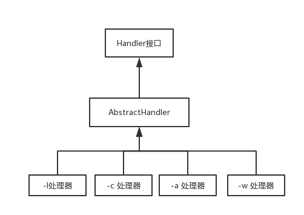
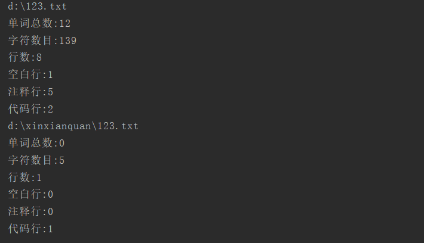
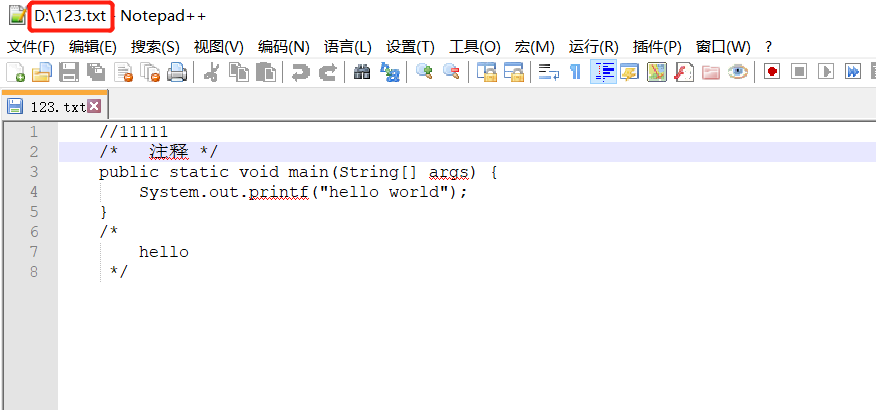

## 要求

- 基本要求

  - [x] -c 统计文件字符数 (实现)

  - [x] -w 统计文件词数 （实现）

  - [x] -l 统计文件行数（实现）

- 扩展功能

  -  [x] -s 递归处理目录下符合条件得文件（实现）
  -  [x] -a 返回文件代码行 / 空行 / 注释行（实现）
  -  [x] 支持各种文件的通配符（*,?）（实现）

- 高级功能

  -  [ ] -x 图形化界面（未实现）

[GitHub仓库：https://github.com/Pramy/wc](https://github.com/Pramy/wc)

## 设计

按照需求可以分为3个模块，1：对文件内容的统计，2：对输入指令的解析，3:批量操作

第一个模块：可以将文本一行一行分析得到自己的结果，可以将一种指令对应一个处理器（handler），在程序启动的时候加载所有处理器，然后针对不同的指令调用不同的处理器，并且应该有获取结果的接口，然后再对各种处理进行抽象，抽象出Handler接口。

第二个模块：第二个模块加上第一个模块就需要相对调整第一个模块，根据输入的指令解析后，得到各种各样的处理器，然后把它连成一条处理链，将需要分析的一行字符串，从头到尾依次处理，也应当有一条获取结果的调用链，从头到尾一次获取处理结果，然后再对模块一的Handler进行抽象，得到AbstractHandler，各种处理器应当继承这个抽象处理器，然后对输入的命令进行匹配，查找

理器的架构图如下




第三个模块：根据-a命令来设计批量分析功能

## 代码

### 启动类App.java

```java
public class App {

    private static final Map<String, Handler> MAP;

    private static boolean IS_RECURSION = false;

    private static String NAME;

    private static Handler HEAD;

    //将处理器存在map中
    static {
        MAP = new HashMap<>();
        MAP.put(Order.L.getCommand(),new LineHandler());
        MAP.put(Order.W.getCommand(),new WordHandler());
        MAP.put(Order.C.getCommand(),new CharHandler());
        MAP.put(Order.A.getCommand(),new StructureHandler());
    }

    public static void main(String[] args) throws IOException {

        File file = build(args);
		//对于通配符的处理
        String name = file.getName();
        if (file.isDirectory()) {
            NAME = ".*";
        } else {
            file = file.getParentFile();
            NAME = name.replaceAll("\\.", "\\\\.").replaceAll("[*?]", ".*");
        }
        if (file == null || !file.exists()) {
            throw new RuntimeException("文件:不存在");
        }
        File[] files = file.listFiles();
        if (files != null) {
            for (File file1 : files) {
                read(file1);
            }
        }
    }

    /**
     * 处理文件
     * @param file 需要分析的文件
     * @throws IOException io
     */
    private static void read(File file) throws IOException {
        if (file.isFile() && file.getName().matches(NAME) && file.canRead()) {
            System.out.println(file.getPath());
            FileReader fileReader = new FileReader(file);
            BufferedReader bf = new BufferedReader(fileReader);
            String s;
            if (HEAD != null) {
                while ((s = bf.readLine()) != null) {
                    //1.将读到的一行字符串从头带尾依次处理
                    HEAD.handle(s);
                }
                //2.处理完成后获取处理结果
                HEAD.get();
                //3.清除处理结果以便接下来的处理
                HEAD.clear();
            }

        }
        //判断是否要递归处理
        if (IS_RECURSION) {
            File[] files = file.listFiles();
            if (files != null) {
                for (File file1 : files) {
                    read(file1);
                }
            }
        }
    }

    /**
     * 构建处理链,然后分析是否要递归查找
     * @param args orders
     * @return file
     */
    private static File build(String[] args) {
        Handler pos = null;
        for (int i = 0; i < args.length - 1; i++) {
            //对指令-s 的处理
            if (args[i].equals(Order.S.getCommand())) {
                IS_RECURSION = true;
            } else {
                Handler handler = MAP.get(args[i]);
                if (handler != null) {
                    if (HEAD == null) {
                        HEAD = handler;
                    } else if (pos instanceof AbstractHandler) {
                        //构建链表
                        ((AbstractHandler) pos).setNext(handler);
                    }
                    pos = handler;
                } else {
                    throw new RuntimeException("参数:" + args[i] + "无效");
                }
            }
        }
        return args.length >= 1 ? new File(args[args.length - 1]) : new File("");
    }
}
```

### AbstractHandler

```java

    @Setter
    private Handler next;

	//调用链的核心代码，只需要子类实现doHandle方法既可以实现链式调用
    @Override
    public void handle(String line) {
        doHandle(line);
        if (next != null) {
            next.handle(line);
        }
    }
	
	protected abstract void doHandle(String line);
```

AbstractHandler是调用链的核心类。如果依次有处理器A->B->C，在调用了A的`handle()`方法后,然后A，B，C的`doHandle()`方法也会依次被调用

### 统计字符-c ：CharHandler

```java
	@Override
    public void doHandle(String line) {
        //windows \r\n
        //Mac	  \r
       	//Unix    \n
        count += line.length() + System.lineSeparator().length();
    }
```

count为字符数，一行字符串后面并没有算上回车符，然后根据不通过的操作系统补上相应的数量

### 统计单词-w：WordHandler

```java
    @Override
    public void doHandle(String line) {
        String s = line.replaceAll("[\\p{Nd}\\u4e00-\\uffe5\\p{Punct}\\s]", " ");
        count += StringUtils.split(s, " ").length;
    }
```

将一行中的数字和和中英文标点符号和中文替换为`" "` ,然后按照`" "`切分得到的数量就是单词数

### 统计行数-l：LineHandler

每一次++就可以，代码过于简单就不贴了

### 统计复杂结构 -a：StructureHandler

```java
public class StructureHandler extends AbstractHandler {
    //空行
    private int emptyLine;
    //代码行
    private int codeLine;
    //注释行
    private int annotationLine;
    //注释开始标志
    private boolean isContinue;

    /**
    	这种属于多行注释
     * @param line line
     */
    @Override
    protected void doHandle(String line) {
        //如果进入了多行注释/* 那必须得匹配*/才可以结束,并且/* */中间的所有行都是注释行
        if (isContinue) {
            if (line.matches(".*\\*/\\s*")) {
                isContinue = false;
            }
            annotationLine++;
        } else {
            //匹配全部是空格或格式控制字符，如果包括代码，则只有不超过一个可显示的字符
            if (StringUtils.isAllBlank(line) || line.matches("\\s*\\p{Graph}\\s*")) {
                emptyLine++;
            //匹配单行注释// 和/* */
            } else if (line.matches("\\s*}?\\s*//.*") || line.matches(".*/\\*.*\\*/.*")) {
                annotationLine++;
            //匹配/*
            } else if (line.matches(".*/\\*.*")) {
                isContinue = true;
                annotationLine++;
            //匹配代码行
            } else {
                codeLine++;
            }
        }
    }

}
```

首先判断是不是多行注释，如果是一定要匹配到结尾符号`*/`才算结束，如果不是多行注释，就对每一行的内容进行分析

## 测试

在命令行输入

```java
java -jar count-1.0-jar-with-dependencies.jar  -w -c -l -a -s d://123.txt
```

然后得到结果



123.txt文件



## PSP


| PSP2.1                                  | Personal Software Process Stages        | 预估耗时（分钟） | 实际耗时（分钟） |
| --------------------------------------- | --------------------------------------- | ---------------- | ---------------- |
| Planning                                | 计划                                    | 30               | 60               |
| · Estimate                              | · 估计这个任务需要多少时间              | 30               | 60               |
| Development                             | 开发                                    | 690              | 1415             |
| · Analysis                              | · 需求分析 (包括学习新技术)             | 30               | 60               |
| · Design Spec                           | · 生成设计文档                          | 30               | 150              |
| · Design Review                         | · 设计复审 (和同事审核设计文档)         | 60               | 120              |
| · Coding Standard                       | · 代码规范 (为目前的开发制定合适的规范) | 30               | 20               |
| · Design                                | · 具体设计                              | 30               | 120              |
| · Coding                                | · 具体编码                              | 240              | 600              |
| · Code Review                           | · 代码复审                              | 30               | 45               |
| · Test                                  | · 测试（自我测试，修改代码，提交修改）  | 240              | 300              |
| Reporting                               | 报告                                    | 80               | 80               |
| · Test Report                           | · 测试报告                              | 20               | 40               |
| · Size Measurement                      | · 计算工作量                            | 30               | 20               |
| · Postmortem & Process Improvement Plan | · 事后总结, 并提出过程改进计划          | 30               | 20               |
| 合计                                    |                                         | 800              | 1555             |

## 总结

从新学了一遍正则表达式，由于一开始思路没有清晰，没有理解清楚需求，导致设计有点偏差，导致花费了大量时间在写无用代码上，造成了极大的浪费，在写代码的过程中希望写的高效经常尝试改写代码，在方案上面一开始没有定夺下来，也可能这方面用得比较少或者缺乏经验，导致走了很多弯路，在这个作业中，重新认识到Java一些比较有用并且高效的知识，收获还是蛮多的